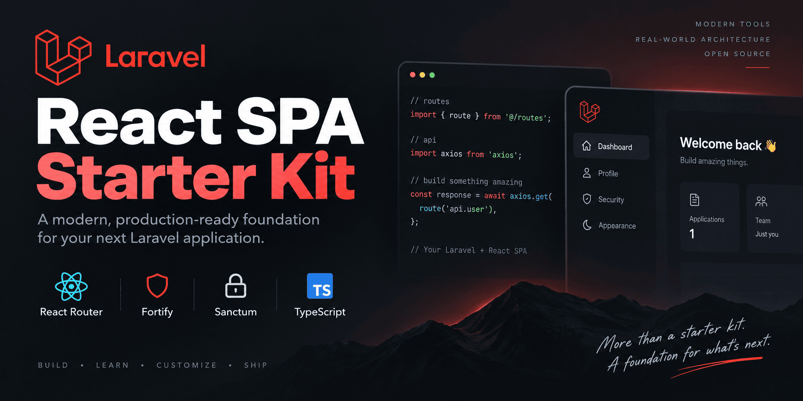

# Laravel React SPA Starter Kit

A community Laravel starter kit for a first-party React SPA using React Router instead of Inertia.js.

[](https://github.com/muradyanvano/laravel-react-spa-starter-kit/actions/workflows/tests.yml)
[](https://packagist.org/packages/muradyanvano/laravel-react-spa-starter-kit)
[](https://packagist.org/packages/muradyanvano/laravel-react-spa-starter-kit)
[](https://packagist.org/packages/muradyanvano/laravel-react-spa-starter-kit)
[](https://laravel.com)
[](LICENSE)

<p align="center">
  
</p>

This is **not** an official Laravel starter kit and is not endorsed by Laravel.

## Why this starter kit

Stack: **Laravel**, **React**, **TypeScript**, **React Router**, **Fortify**, **Sanctum**, **Wayfinder**, and **Vite**.

Architecture choice: a traditional same-origin SPA instead of Inertia.js.

```text
Laravel (API / Fortify / Sanctum)
  → Blade SPA shell
  → React + React Router
  → Axios
```

UI and developer experience are inspired by Laravel’s official React starter kit; the runtime is a conventional SPA with browser-owned routing.

## Quick Start

### Laravel Installer

```bash
laravel new my-app --using=muradyanvano/laravel-react-spa-starter-kit
cd my-app
npm run dev
```

### Composer create-project

Install the latest stable release from Packagist:

```bash
composer create-project muradyanvano/laravel-react-spa-starter-kit my-app
cd my-app
npm run dev
```

Pin a specific version when you need a reproducible install:

```bash
composer create-project muradyanvano/laravel-react-spa-starter-kit my-app v1.0.0
```

> **Note:** Passkey support ships in **v1.1.0**. The latest stable tag on Packagist is still **v1.0.0** until v1.1.0 is published.

### Requirements

- PHP 8.3+
- Composer
- Node.js 22+ (recommended; CI also covers Node 25)
- SQLite (default) or another supported database

The generated project is a normal Laravel application you own and can customize freely.

## Features

### Authentication

- Login / registration / logout
- Password reset
- Email verification
- Password confirmation
- **Passkey sign-in** (WebAuthn)
- **Passkey password confirmation**
- Two-factor authentication (password login)
- Recovery codes

### Application

- Responsive sidebar shell and mobile navigation
- Dashboard
- Profile settings (including password change and account deletion)
- Security settings (password, 2FA, **passkey management**)
- Appearance settings (light / dark / system)

### Passkeys

Passkeys provide passwordless sign-in through your browser or platform authenticator (Touch ID, Windows Hello, security keys, and similar).

**Sign in:** On the login page, use **Sign in with a passkey** when your browser supports WebAuthn. Password login remains available as a fallback.

**Confirm sensitive actions:** On the confirm-password page, you can confirm with a passkey instead of re-entering your password when supported.

**Manage passkeys:** In **Settings → Security**, you can:

- view registered passkeys (name, authenticator label, created/last-used metadata)
- add/register a new passkey
- delete a passkey (with confirmation)

Adding or deleting passkeys requires recent password or passkey confirmation when Fortify password confirmation is enabled.

Passkeys depend on browser and platform WebAuthn support. Unsupported browsers can still view and delete existing passkeys, but cannot register new ones from the UI.

This kit does **not** implement conditional WebAuthn autofill, passkey “remember me”, or custom credential synchronization.

### Developer experience

- TypeScript
- Laravel Wayfinder
- Axios
- Tailwind CSS + shadcn/ui
- Pest, Vitest, PHPStan, Pint
- Optional Laravel Boost support

## Architecture

| Concern                | This kit                        |
| ---------------------- | ------------------------------- |
| Browser routing        | React Router                    |
| Auth capabilities      | Laravel Fortify                 |
| SPA session auth       | Sanctum stateful cookies + CSRF |
| HTTP client            | Axios                           |
| WebAuthn ceremonies    | `@laravel/passkeys`             |
| Typed routes / actions | Laravel Wayfinder               |
| Page shell             | Blade SPA shell + React         |
| Inertia                | Not used                        |

**Laravel** owns the API/backend, Fortify endpoints, Sanctum session authentication, and the SPA shell/fallback.

**React** owns browser routing, layouts/pages, authentication state, and API interaction.

Laravel serves the Blade SPA shell for browser routes such as `/dashboard` and `/settings/profile`. The catch-all does **not** swallow `/api/*`, `/sanctum/*`, `/up`, `/email/*`, `/storage/*`, Fortify endpoints, or public assets.

## Authentication and security

Default design: Laravel and the SPA share one origin (for example `https://example.com`).

- Sanctum cookie / session authentication (not JWT or bearer tokens in browser storage)
- CSRF protection via `/sanctum/csrf-cookie` and `X-XSRF-TOKEN`
- No auth tokens stored in `localStorage`
- Session regeneration on authentication events
- Password confirmation for sensitive actions (including passkey registration and deletion when configured)
- Email verification
- Two-factor authentication and recovery-code handling for **password login**
- WebAuthn passkeys through Laravel Fortify and `laravel/passkeys`

**Password login and 2FA:** When two-factor authentication is enabled, password login continues through Fortify’s normal TOTP/recovery-code challenge.

**Passkey login:** Native Fortify passkey authentication completes the session directly and does **not** route through the password-login two-factor challenge.

**Passkey metadata:** The settings passkey list API returns display metadata only (name, authenticator label, human-readable timestamps). Credential material is never exposed to the frontend.

Split-origin deployments need correct `SANCTUM_STATEFUL_DOMAINS`, session cookie domain/SameSite, CORS, and CSRF configuration. That layout is out of scope for the default kit.

Useful variables: `APP_URL`, `SESSION_DOMAIN`, `SESSION_SECURE_COOKIE`, `SANCTUM_STATEFUL_DOMAINS`, `MAIL_*`.

Password reset and email verification use Laravel’s mailer. Configure `MAIL_*` (or a local driver such as log / Mailpit) before relying on those flows outside tests.

## Appearance

Appearance is client-driven (light / dark / system) via `localStorage` and an `appearance` cookie, matching the official-kit style settings experience.

## Development

From a generated app or a clone of this repository:

```bash
composer setup      # install deps, .env, key, migrate, build
composer dev        # concurrent PHP + Vite + queue/logs helpers
composer test       # Pint + PHPStan + Pest
composer ci:check   # frontend gates + backend suite
```

Frontend:

```bash
npm run dev
npm run build
npm run test
npm run check
npm run types:check
```

Or run `php artisan serve` and `npm run dev` in separate terminals.

### Working on this repository

```bash
git clone https://github.com/muradyanvano/laravel-react-spa-starter-kit.git
cd laravel-react-spa-starter-kit
composer setup
```

## Testing and quality

CI runs on pushes and pull requests against `main`, including:

- Pest (PHP)
- Vitest (React)
- PHPStan
- TypeScript (`types:check`)
- ESLint / formatting (`check`)
- Laravel Pint
- Production build verification
- Fresh git-archive consumer install checks
- Node.js **22** and **25** matrix coverage

Exact test counts belong in release notes; they change over time.

## Wayfinder

These directories are **generated** and gitignored:

- `resources/js/actions`
- `resources/js/routes`
- `resources/js/wayfinder`

Do not edit or commit them. `npm run build` / `npm run dev` generate them via `@laravel/vite-plugin-wayfinder`. `npm run types:check` also ensures they exist before TypeScript runs.

On a completely fresh tree, run `composer setup` (or at least `npm run build` / `npm run types:check`) before expecting TypeScript imports from `@/routes` to resolve.

## Laravel Boost

[`laravel/boost`](https://github.com/laravel/boost) is an optional development dependency for AI-assisted coding.

Boost setup is **not** mandatory. After creating an app, install Boost guidelines/skills only if you want them:

```bash
php artisan boost:install
```

The Laravel installer may also offer Boost during `laravel new`. Generated Boost state (`boost.json`, agent guideline files such as `AGENTS.md`) is gitignored and is **not** shipped to Packagist consumers.

## Attribution

UI and developer experience inspired by Laravel’s official [React starter kit](https://github.com/laravel/react-starter-kit), including passkey UI patterns.

This community project is independent of Laravel and is **not** an official starter kit maintained by Laravel. See [`NOTICE.md`](NOTICE.md) for third-party notices.

## Links

- [GitHub repository](https://github.com/muradyanvano/laravel-react-spa-starter-kit)
- [Packagist package](https://packagist.org/packages/muradyanvano/laravel-react-spa-starter-kit)
- [Contributing](CONTRIBUTING.md)
- [Security policy](SECURITY.md)
- [License](LICENSE)
- [Notice](NOTICE.md)
- [Laravel documentation](https://laravel.com/docs)
- [React documentation](https://react.dev)
- [React Router documentation](https://reactrouter.com)

## License

MIT — see [`LICENSE`](LICENSE) and [`NOTICE.md`](NOTICE.md).
